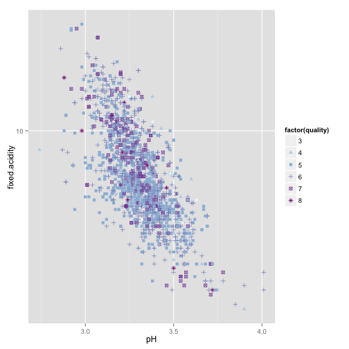
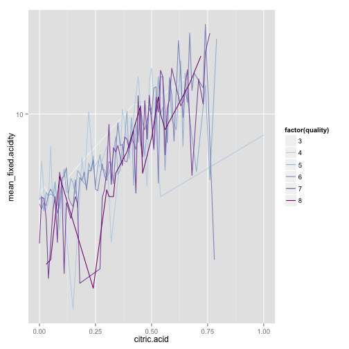
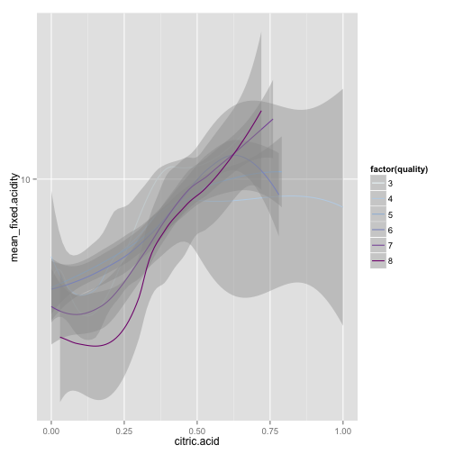

In understanding the red Wine Quality Factors
========================================================

This is an R Markdown document. Markdown is a simple formatting syntax for authoring web pages (click the **Help** toolbar button for more details on using R Markdown).

When you click the **Knit HTML** button a web page will be generated that includes both content as well as the output of any embedded R code chunks within the document. You can embed an R code chunk like this:

## Dataset citation
P. Cortez, A. Cerdeira, F. Almeida, T. Matos and J. Reis.    
Modeling wine preferences by data mining from physicochemical properties.  
In Decision Support Systems, Elsevier, 47(4):547-553. ISSN: 0167-9236.  

Available at: [@Elsevier] http://dx.doi.org/10.1016/j.dss.2009.05.016  
              [Pre-press (pdf)] http://www3.dsi.uminho.pt/pcortez/winequality09.pdf  
              [bib] http://www3.dsi.uminho.pt/pcortez/dss09.bib  

## Dataset description
Note: The below text is a snipped and direct citation of the description of the parameters from the authors of the dataset.

5. Number of Instances: red wine - 1599; white wine - 4898. 

6. Number of Attributes: 11 + output attribute
  
   Note: several of the attributes may be correlated, thus it makes sense to apply some sort of
   feature selection.

7. Attribute information:

   For more information, read [Cortez et al., 2009].

   Input variables (based on physicochemical tests):
   1 - fixed acidity (tartaric acid - g / dm^3)
   2 - volatile acidity (acetic acid - g / dm^3)
   3 - citric acid (g / dm^3)
   4 - residual sugar (g / dm^3)
   5 - chlorides (sodium chloride - g / dm^3
   6 - free sulfur dioxide (mg / dm^3)
   7 - total sulfur dioxide (mg / dm^3)
   8 - density (g / cm^3)
   9 - pH
   10 - sulphates (potassium sulphate - g / dm3)
   11 - alcohol (% by volume)
   Output variable (based on sensory data): 
   12 - quality (score between 0 and 10)

8. Missing Attribute Values: None

9. Description of attributes:

   1 - fixed acidity: most acids involved with wine or fixed or nonvolatile (do not evaporate readily)

   2 - volatile acidity: the amount of acetic acid in wine, which at too high of levels can lead to an unpleasant, vinegar taste

   3 - citric acid: found in small quantities, citric acid can add 'freshness' and flavor to wines

   4 - residual sugar: the amount of sugar remaining after fermentation stops, it's rare to find wines with less than 1 gram/liter and wines with greater than 45 grams/liter are considered sweet

   5 - chlorides: the amount of salt in the wine

   6 - free sulfur dioxide: the free form of SO2 exists in equilibrium between molecular SO2 (as a dissolved gas) and bisulfite ion; it prevents microbial growth and the oxidation of wine

   7 - total sulfur dioxide: amount of free and bound forms of S02; in low concentrations, SO2 is mostly undetectable in wine, but at free SO2 concentrations over 50 ppm, SO2 becomes evident in the nose and taste of wine

   8 - density: the density of water is close to that of water depending on the percent alcohol and sugar content

   9 - pH: describes how acidic or basic a wine is on a scale from 0 (very acidic) to 14 (very basic); most wines are between 3-4 on the pH scale

   10 - sulphates: a wine additive which can contribute to sulfur dioxide gas (S02) levels, wich acts as an antimicrobial and antioxidant

   11 - alcohol: the percent alcohol content of the wine

   Output variable (based on sensory data): 
   12 - quality (score between 0 and 10)
   
## Purpose
   One of the first things that come to my mind when looking at this dataset is:
   What makes a good red wine?
   
   And we are going to explore just that.
   
## Visualizations and interpretations

```
## Error in contrib.url(repos, "source"): trying to use CRAN without setting a mirror
```

```
## Error in contrib.url(repos, "source"): trying to use CRAN without setting a mirror
```

```
## Error in contrib.url(repos, "source"): trying to use CRAN without setting a mirror
```


Droping the X column from the dataset.  


Summary of the read wine dataset.  

```
##  fixed.acidity   volatile.acidity  citric.acid    residual.sugar  
##  Min.   : 4.60   Min.   :0.1200   Min.   :0.000   Min.   : 0.900  
##  1st Qu.: 7.10   1st Qu.:0.3900   1st Qu.:0.090   1st Qu.: 1.900  
##  Median : 7.90   Median :0.5200   Median :0.260   Median : 2.200  
##  Mean   : 8.32   Mean   :0.5278   Mean   :0.271   Mean   : 2.539  
##  3rd Qu.: 9.20   3rd Qu.:0.6400   3rd Qu.:0.420   3rd Qu.: 2.600  
##  Max.   :15.90   Max.   :1.5800   Max.   :1.000   Max.   :15.500  
##    chlorides       free.sulfur.dioxide total.sulfur.dioxide
##  Min.   :0.01200   Min.   : 1.00       Min.   :  6.00      
##  1st Qu.:0.07000   1st Qu.: 7.00       1st Qu.: 22.00      
##  Median :0.07900   Median :14.00       Median : 38.00      
##  Mean   :0.08747   Mean   :15.87       Mean   : 46.47      
##  3rd Qu.:0.09000   3rd Qu.:21.00       3rd Qu.: 62.00      
##  Max.   :0.61100   Max.   :72.00       Max.   :289.00      
##     density             pH          sulphates         alcohol     
##  Min.   :0.9901   Min.   :2.740   Min.   :0.3300   Min.   : 8.40  
##  1st Qu.:0.9956   1st Qu.:3.210   1st Qu.:0.5500   1st Qu.: 9.50  
##  Median :0.9968   Median :3.310   Median :0.6200   Median :10.20  
##  Mean   :0.9967   Mean   :3.311   Mean   :0.6581   Mean   :10.42  
##  3rd Qu.:0.9978   3rd Qu.:3.400   3rd Qu.:0.7300   3rd Qu.:11.10  
##  Max.   :1.0037   Max.   :4.010   Max.   :2.0000   Max.   :14.90  
##     quality     
##  Min.   :3.000  
##  1st Qu.:5.000  
##  Median :6.000  
##  Mean   :5.636  
##  3rd Qu.:6.000  
##  Max.   :8.000
```

There is only one categorical variable for this data set and it is the 'quality' variable.
It is informative to see what amount of examples for each class/quality of wine are available.  
 

The histogram shows a distribution which is rather sparse
but still looks like a normal distribution and it shows that there
are just a few examples of wines with quality of 3 or 8.

Looking back at the data set summary the mean wine quality is 5.6 which is consistent with the histogram
and we can think of wines with quality of 6 or greater as high quality (vs low quality wines).


  
 


Ploting pairs of variables, the scatter matrix shows there is a correlation above 0.6 for fixed.acidity and citric.acid (0.672), fixed.acidity and density (0.668), fixed.acidity and pH (-0.683),     
free.sulfur.dioxide and total.sulfur.dioxide (0.668) and very low correlation for volatile.acidityand residual.sugar (0.00192).  
The largest positive correlation betwee quality and another variable is between quality and alcohol (0.476).  
There is a somewhat significant negative correlation between volatile.acids and quality (-0.391) which seems to agree with the notion that after some point the level of volatile acids makes the wine  
taste like vinegar and thus be unpleasent for drinking.  

 

There are no variables with strong correlation to quality (> 0.5 or < -0.5) so the pairs plot does not make very clear
to us how each chemical component affects the quality of the wine. The boxplot can help here.  
It reveals that higher quality wines tend to have higher concentrations of sulphate, alcohol and citric acid. 
Also higer quality wines tend to have lower concentrations of volatile acidity, chlorides and tend to have lower density and pH.

 

Since residual sugar is the sugar left after fermentation and fermentation is connected to alcohol it is logical to think there might be a strong relation between both.
Indeed the distribution of their ratio looks more symmetric then  
their individual distributions. It is interesting to make linear regression based on the residual sugar vs quality and another linear regression with residual.sugar/alcohol vs quality. If it is true that the distribution of residual.sugar/alcohol  
is closer to normal then the linear regression based on it should be more accurate. This in turn can later be used to build more complex regression.


```
## 
## Call:
## lm(formula = df$quality ~ log10(df$residual.sugar))
## 
## Residuals:
##     Min      1Q  Median      3Q     Max 
## -2.6834 -0.6327  0.3457  0.3751  2.3913 
## 
## Coefficients:
##                          Estimate Std. Error t value Pr(>|t|)    
## (Intercept)               5.59082    0.05213 107.255   <2e-16 ***
## log10(df$residual.sugar)  0.12243    0.13014   0.941    0.347    
## ---
## Signif. codes:  0 '***' 0.001 '**' 0.01 '*' 0.05 '.' 0.1 ' ' 1
## 
## Residual standard error: 0.8076 on 1597 degrees of freedom
## Multiple R-squared:  0.0005538,	Adjusted R-squared:  -7.201e-05 
## F-statistic: 0.8849 on 1 and 1597 DF,  p-value: 0.347
```

```
## 
## Call:
## lm(formula = df$quality ~ log10(df$alcohol))
## 
## Residuals:
##     Min      1Q  Median      3Q     Max 
## -2.8653 -0.3942 -0.1694  0.5100  2.5846 
## 
## Coefficients:
##                   Estimate Std. Error t value Pr(>|t|)    
## (Intercept)        -3.4740     0.4204  -8.263 2.95e-16 ***
## log10(df$alcohol)   8.9681     0.4135  21.687  < 2e-16 ***
## ---
## Signif. codes:  0 '***' 0.001 '**' 0.01 '*' 0.05 '.' 0.1 ' ' 1
## 
## Residual standard error: 0.71 on 1597 degrees of freedom
## Multiple R-squared:  0.2275,	Adjusted R-squared:  0.227 
## F-statistic: 470.3 on 1 and 1597 DF,  p-value: < 2.2e-16
```

```
## 
## Call:
## lm(formula = df$quality ~ log10(df$residual.sugar/df$alcohol))
## 
## Residuals:
##     Min      1Q  Median      3Q     Max 
## -2.7811 -0.6418  0.2719  0.3757  2.5565 
## 
## Coefficients:
##                                     Estimate Std. Error t value Pr(>|t|)
## (Intercept)                          5.28275    0.08478  62.315  < 2e-16
## log10(df$residual.sugar/df$alcohol) -0.54638    0.12738  -4.289  1.9e-05
##                                        
## (Intercept)                         ***
## log10(df$residual.sugar/df$alcohol) ***
## ---
## Signif. codes:  0 '***' 0.001 '**' 0.01 '*' 0.05 '.' 0.1 ' ' 1
## 
## Residual standard error: 0.8032 on 1597 degrees of freedom
## Multiple R-squared:  0.01139,	Adjusted R-squared:  0.01077 
## F-statistic:  18.4 on 1 and 1597 DF,  p-value: 1.9e-05
```


For all of the following variables it is assumed they are log10 transformed as shown in the above histograms.
The lenear regression for residual sugar vs quality has Residual standard error: 0.8077, alcohol vs quality has Residual standard error: 0.7104 and   
(residual sugar)/alcohol vs quality has Residual standard error: 0.7449.  Indeed the induction made earlier is true, (residual sugar)/alcohol vs quality has better linear fit than just residual sugar.  
But alcohol itself has the best linear fit to quality although its distributions looksthe least normal.  
 

Different acids and pH are connected in nature (derived one from the other) thus we should look their distributions grouped together.  
 

With the exception of citric acid all distributions look normal.

Let's look at the distributions of dioxides, chlorides and shlphates together.  

 

And again all distributions look normal except for the distribution of free sulfur dioxide which looks skewed to the right similarly to citric acid distribution.
The pairs plot shows almost zero correlation between those two variables however.


How do the variable distributions look across different wine qualities?
Thensity plots will show us, and we expect to show us similar information as the box plots since we saw comparisons of median values
and now we will essentially look at mean values.  
However the density plots might show is variables with heavy outliers as median calculations
work as filter for outliers where mean does not.  
 

The density plots for wine densities reveal that higher quality wines have
lower densities. However the density only varies in the third decimal place.
The density distribution is normal.  
 

The boxplots only confirm the observations made so far and particularly the conslusions made
from the self organized map.
Wine quality monotonically increases as fixed acidity and citric acid increase and monotonically
decreases as volatile acidity increases.  
Although not monotonical, there is also a well
distinguishable increase of alcohol content as quality increases.
Futhermore the boxplot for sulphates shows that also as sulphates increase the quality of wine
also increases.


Let's start with the pH and fixed.acidity as they have the highest correlation (as absolute value).  

   

Ploting pH against fixed.acidity, it can be seen that with pH decreasing the variance in fixed.acidity increases. And as the variance in fixed.acidity increases it can be also noticed that wines with quality 
greater than 6 tend to have higher fixed.acidity for pH kept constant.

Next we look at citric.acid vs fixed.acidity. They have highest positive correlation.  
   

There is some trend here. For the same citric acid the wines with quality 6 or more have lower levels
of fixed acidity.
We should notice that taking the log10 on the y scale gives a good looking linear trends for the  
previous two plots and thus a linear model can be built for those variables.

Let us find the mean fixed acidity for each wine quality and plot it.  
 

Just a line plot looks very noisy and does not make clear what is happening.
So a smooth plot was used and it shows once again that pH vs log10(fixed.acidity))
follow aproximately linear trend indeed. Furthermore this is true for all of the 
wine quality categories.   
Interesting about this visualization is that the trends are naturally ordere for 3 reasons:
1) there is a common intersection point for all quality trends/lines at around 3.3 pH.
2) for pH > 3.3 (approximately) taking any point on the pH axis the fixed.acidity value increases as   
the wine quality decreases, having the highest quality wines with lowest fixed acidity and
the lowest quality winest with the highest fixed acidity (and this ordering kept in between).
3) for pH > 3.3 (approximately) as the quality of the wine decreases the slope of the line,  
approximating the relation pH vs fixed.acidity, increases.  
Thus after the point of intersection
the ordering of wine quality vs fixed acidity is reversed but still the highest quality wine
has less fixed acidity than most other wines for the same pH with the exception of quality 3 wines.  

  

Similar trends are observed when ploting log10 transformed mean fixed acidity agains citric acid grouped by quality.
However differently from the scatter plot here the trends of the mean values can be described better by cubic functions.  


On the density histograms for pH and volatile acidity it is clearly visible how
the peak of the histogram shifts from left to right as quality decreases. But that
is most prominent in the volatile acidity histogram.  


```
## Error in contrib.url(repos, "source"): trying to use CRAN without setting a mirror
```


Using self organized Kohonen maps is helpful when we want to summarize and visualize
high dimentional data in 2 dimensions.  
 


From the self organized map it is visible that highest quality wines are associated with
slightly above average alcohol percentage and citric acid. The same is also characterized by
slightly below averagge fixed acidity, pH, density and sulphates.

Low grade wines are characterized by having only one component above average and
that component being either volatile acidity or sulfure dioxide (total or free) above averate,  
or no component at all above average.

Medium grade wines have 2 or more components around average or above (except volatile acidity). 


## Final Plots and Summary
We can reduce the complexity of the problem by reducing its dimensionality.
So what we will do next is to split the wines in only two classes - high (2) and low (1) class.
We must use numeric values for class instead of string because the self organized map expects so.

### Summary Plot 1
This plot allows for visualization of high dimensional data in 2 dimensions. Furthermore, the nuances for
each variable are reduced to binary (high quantity, low quantity) which simplifies the understanding of the
different wine parameters and their relations to quality.  

 

### Conclusion 1
It can be seen here that high class (qualit) red wine is strongly associated (relative to low class red wines) with higher contents of alcoho, sulphates, density, fixed acidity, citric acid, residual sugar, clorides.  
On the other hand, low class (quality) red wines are associated strongly with high contents of volatile acidity, total and free sulphur dioxide and higher levels of pH.

### Summary Plot 2
All wines with quality of 6 or above are regarded as high quality and all the rest as low quality.  
This plots the two classes are separable, which is easy to perceive for humans and can be used to 
build algorithms that automatically determine wine quality.  
 

### Conclusion 2
The plot conclusevely shows that indeed better wines have lower concentrations of volatile acidity
for the same concentration of alcohol.  
Furthermore as the alcohol concentration increases the vilatile
acids decrease for good quality wines.

### Summary Plot 3
The plots show analogy to Summary Plot 1 and how here ratios are linearly separable for
high vs low quality wines.  
 

### Conclusion 3
The self organized map showed that higher pH levels, volatile acidity, free and total sulfur dioxide are
asociated more with lower grade wines. It is also curious that they are related to each other (in pairs) by nature.  
The pH and acidity are naturaly related, free and total sulfur dioxide are naturaly related too as they are both sulfur dioxide.
Ploting the ratio of the pairs agains one another confirmes one more time all observations so far.  
High and low quality wines are clearly separated, the ratio pH/volatile.acidity is much higher for
the better class wines.


## Reflection

I began the understanding of the red wine dataset by looking at the distribution of samples across
the quality spectrum. It was quite surprising that there were samples of wine only in the range
between 3 and 8 (including) and there were very few examples of wine with quality 3 (10) and 8 (18).  
To get the sense of how one parameter of the wine affects the others a pair plot of all variables was
used. It was the sarting point which directed my attention to those pairs of variables that are most
correlated and to those single variables that are most correlated to the quality of the wine.  
Closer look at pH, fixed acidity and citric acidity showed these parameters are not single handedly
defining the quality of the wine. On the other hand high volatile acidity content strongly affects
the quality of the wine and the box plot showed that average quality 8 wine has 2 times lower contents  
than the average quality 3 wine.  
Visualizations of self organizing maps captured all dimensions of the dataset in 2 dimensional plots
and helped me to confirm the observations made so far and to discover underlying relations between all
variables. It showed how all parameters combine to form the levels of wine quality.  
Such self organized maps can be further used to predict the quality of the wine. It will be interesting to have a bigger set
to be able to truly test the ability of such a model. It is also a good question to ask if there are trends 
in peoples taste over the years and what they find good quality wine  
may change with time.  
So I would be curious to explore a dataset with chronological data and data that is spanning to more recent trends too.
Overall the exploration showed that all variables affect the wine quality and there might be one component
that makes a bad wine but one component does not make a good wine.
